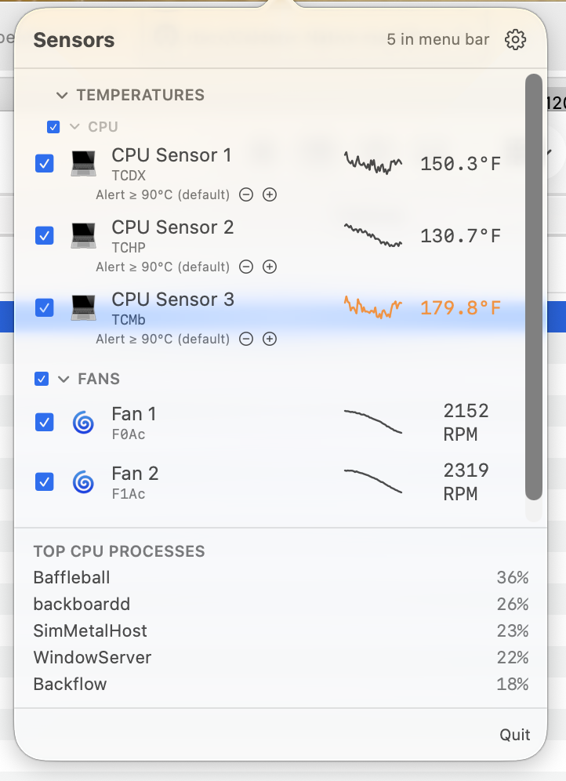
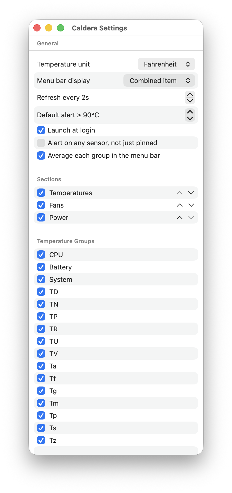

<table><tr>
<td></td>
<td valign="middle"><h1>Caldera</h1></td>
</tr></table>

A native macOS menu bar app that reads temperature, fan, and power sensors
directly via IOKit/SMC — no third-party libraries, no Activity-Monitor-style
overhead.

<table align="center">
  <tr>
    <td></td>
    <td></td>
  </tr>
</table>

## Features

- Reads real hardware sensors via the System Management Controller, with
  sensor keys discovered dynamically at launch (not hardcoded), since Apple
  Silicon's SMC key meanings shift across chip generations
- Pin any sensor to the menu bar as `icon value`; pin several and they join
  with `::`, or show one combined item instead of separate ones
- Popover lists every sensor grouped by hardware area, with collapsible
  sections, per-sensor alert thresholds, history sparklines, and °C/°F
- Optional per-group averaging — collapse all pinned CPU sensors (etc.) into
  one averaged menu bar entry with its own SF Symbol glyph
- Settings window: hide or reorder sections/sensors, launch at login, alert
  scope, refresh interval
- Best-effort system notification + a "Running hot" banner listing the
  system's top CPU-consuming processes when a pinned sensor crosses its
  threshold

## Requirements

- Apple Silicon Mac, macOS 13+
- Xcode command line tools (`xcode-select --install`)

## Download

Grab `Caldera.app.zip` from the [latest release](https://github.com/dscx/Caldera/releases/latest), unzip it, and move `Caldera.app` wherever you like.

It's ad-hoc signed only (no Apple Developer ID, not notarized), so macOS
blocks it on first launch — and on current macOS, the dialog you get from
double-clicking or right-click → Open only offers **Move to Trash** or
**Done**, with no direct bypass. To actually open it, use one of:

- **System Settings:** try to open the app once (so macOS registers the
  block), then go to **System Settings → Privacy & Security**, scroll to
  the security message about `Caldera.app`, and click **Open Anyway**.
  Confirm once more when it re-launches. Only needed the first time.
- **Terminal:** strip the quarantine flag yourself, then open it normally:
  ```bash
  xattr -d com.apple.quarantine /path/to/Caldera.app
  ```

## Build & run

```bash
./build.sh
open Caldera.app
```

`build.sh` compiles a release binary via Swift Package Manager and assembles
`Caldera.app`. The app isn't sandboxed (SMC access requires that), so it
can't go through the Mac App Store.

## License

MIT — see [LICENSE](LICENSE).
